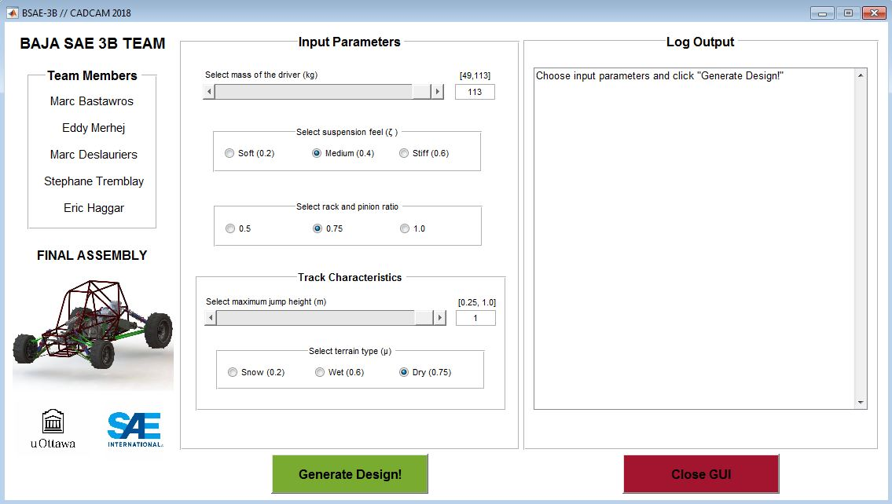

# BajaSAEParametrization

BajaSAEParametrization is a mechanical engineering capstone project completed at the University of Ottawa. The purpose of this project was to design and analyze a fully parametrizable BAJA SAE off-road vehicle. I created a user-friendly MATLAB GUI to automate the parametrization process.




## Getting Started 

Clone the repository with:

```
git clone https://github.com/EricHaggar/BajaSAEParametrization.git
```

and change your directory to the project

```
cd BajaSAEParametrization
```

Open the directory

```
start .
```

Move folder `2018` into a `Z` drive. Folder structure must be the following: 

```
Z:\2018\MCG4322A\Digital Files\BSAE-3B
```

## Requirements

Make sure you have an up-to-date version of MATLAB and SolidWorks.

| Software                                                           | Version |
| ------------------------------------------------------------------ | ------- |
| [MATLAB](https://www.mathworks.com/products/matlab.html)                                          | R2018b  |
| [SolidWorks](https://launch.solidworks.com/) | 2018   |

## GUI Instructions

1. Navigate to the `BSAE-3B` folder and open the 
 In the current directory, open the MAIN.m file. ***PLEASE NOTE: No other matlab function file can be run on its own. Therefore, if you try to run any .m file, other than MAIN.m, an error will occur since each function expects parameters (inputs) when called.*** 

2. Before pressing RUN, right-click on the opened file in the editor and click `Change current folder to ...`.

3. Now we are ready to run the GUI! In the editor tab, click Run and the GUI will pop-up on the screen.

4. Choose all desired input parameters, then click the green button titled `Generate Design!`.

5. There will be a message box that appears on the screen to let you know that the parametrization is in progress. Once complete, a second message box will appear to inform you that the design was successfully optimized. On the right-hand side of the GUI, the Log Output panel will be populated with the Log text file found at:  
`Z:\2018\MCG4322A\Digital Files\BSAE-3B\Log\BSAE-3B_LOG.txt`.

6. The SolidWorks is now ready to be re-built! Navigate to `Z:\2018\MCG4322A\Digital Files\BSAE-3B` and open the TOP LEVEL ASSEMBLY SolidWorks Assembly file. Once opened, press re-build :vertical_traffic_light: and wait for the SolidWorks to update to the Optimized dimensions. Many of the changes are internal, such as tube thickness of the frame and suspension, and will require cross-section views to notice the changes. ***PLEASE NOTE: If there are warnings or errors when the assembly opens, please re-build again.***

7. Enjoy playing with the suspension and steering on SolidWorks!

## Built With

* [GUIDE](https://www.mathworks.com/discovery/matlab-gui.html)
